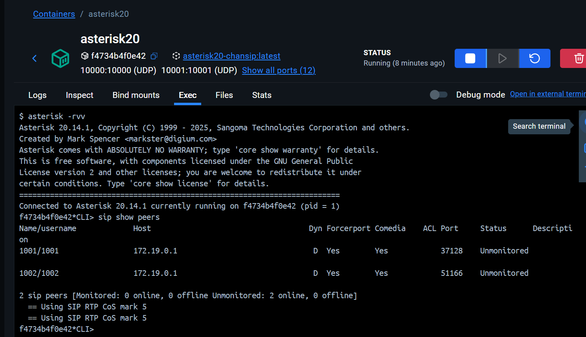

# Proyecto Asterisk con Docker

Este proyecto contiene una configuración de un servidor Asterisk que se ejecuta dentro de un contenedor de Docker. Está diseñado para ser una base portable, fácil de desplegar y personalizable para una centralita VoIP.



## Características Principales

- **Despliegue con Docker:** Utiliza Docker y Docker Compose para un entorno aislado y consistente.
- **Configuración Persistente:** Los archivos de configuración, logs y datos (como las grabaciones) se almacenan en el host local, sobreviviendo a reinicios del contenedor.


---

## Estructura del Proyecto

```
.
├── docker-compose.yml  # Orquesta la creación del contenedor de Asterisk.
├── dockerfile          # Para construir una imagen de Docker personalizada.
├── config/             # Archivos de configuración de Asterisk.
│   ├── extensions.conf # Plan de marcación (Dialplan).
│   ├── sip.conf        # Cuentas y configuración SIP.
│   └── modules.conf    # Módulos de Asterisk a cargar.
├── logs/               # Logs generados por Asterisk.

```

## Requisitos

- [Docker](https://www.docker.com/get-started)
- [Docker Compose](https://docs.docker.com/compose/install/)

---

## Instalación y Uso

1.  **Clonar el repositorio (si aplica):**
    ```sh
    git clone <https://github.com/grimaldi2706/Asterisk-docker>
    cd Asterisk-docker
    ```

2.  **Iniciar los servicios:**
    Ejecuta el siguiente comando en la raíz del proyecto para iniciar el contenedor de Asterisk en segundo plano.
    ```sh
    docker-compose up -d
    ```

---

## Configuración


Toda la configuración de Asterisk se encuentra en el directorio `config/`. Después de realizar cambios, es necesario recargar la configuración correspondiente en Asterisk.

### Añadir Extensiones SIP

Para añadir o modificar usuarios/extensiones SIP, edita el archivo `config/sip.conf`.

**Ejemplo:**
```ini
[1003]
type=friend
context=internal
host=dynamic
secret=password
disallow=all
allow=ulaw
```

### Modificar el Plan de Marcación (Dialplan)

La lógica de las llamadas (qué sucede cuando alguien marca un número) se gestiona en `config/extensions.conf`.

---


